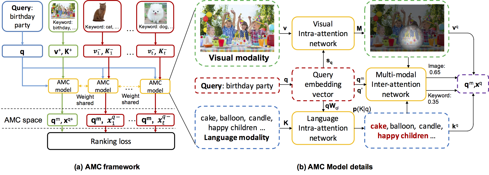
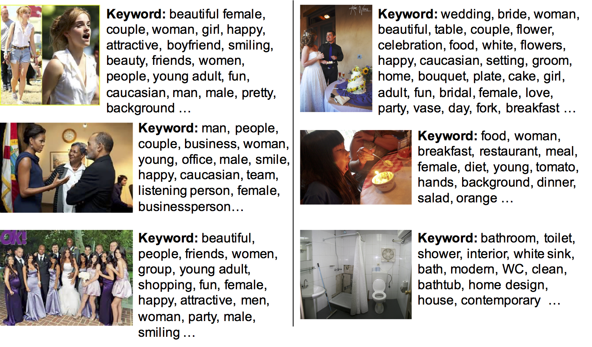
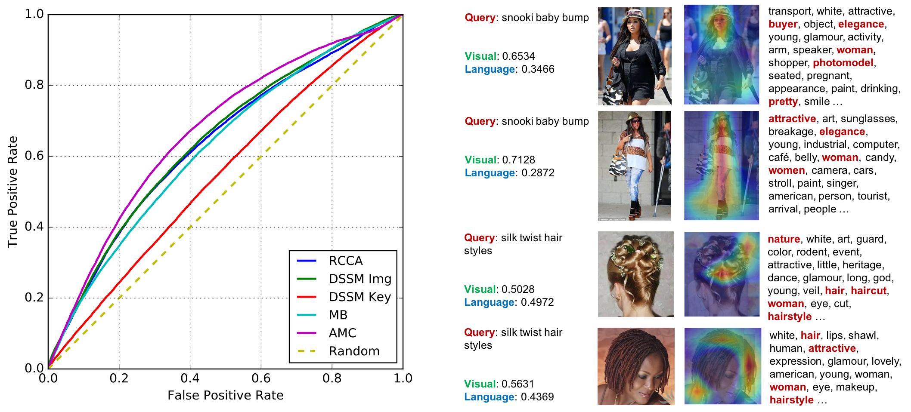

# AMC: Attention guided Multi-modal Correlation Learning for Image Search
This repository includes annotated keyword datasets used by AMC system (CVPR 2017)

## Introduction

**AMC System** is initially described in an [arxiv tech report](https://arxiv.org/abs/1704.00763). We leverage visual and textual modalities for image search by learning their correlation with input query. According to the intent of query, attention mechanism can be introduced to adaptively balance the importance of different modalities.

## Framework

The framework of AMC is shown below



We propose a novel Attention guided Multi-modal Correlation (AMC) learning method which consists of a jointly learned hierarchy of intra and inter-attention networks. Conditioned on query's intent, intra-attention networks (i.e., visual intra-attention network and language intra-attention network) attend on informative parts within each modality; a multi-modal inter-attention network promotes the importance of the most query-relevant modalities.

## Keyword datasets download

To validate the effectiveness of AMC System, we annotated a keyword dataset for [Microsoft Clickture dataset](https://www.microsoft.com/en-us/research/project/clickture/) and [MSCOCO Image Caption dataset](http://mscoco.org/dataset/#captions-challenge2015) using an auto-tagging system for each image. Some of the results are shown below (left and right columns are selected samples from Clickture and MSCOCO caption dataset respectively.)

<p align="center">
  
</p>

The download link for keyword datasets is provided in [~~[dropbox]~~](https://www.dropbox.com/sh/g5fojtxuzpw8wo1/AAB9uFZsMsHpBLqw4E9ldgBda?dl=0) [[google drive]](https://drive.google.com/drive/folders/1x4HAg5Mitx9sWo1XoQJ8aDKuMjObSgiX?usp=sharing).
If you find our dataset useful in your research, please consider citing:
```
@InProceedings{Chen_2017_CVPR,
author = {Chen, Kan and Bui, Trung and Fang, Chen and Wang, Zhaowen and Nevatia, Ram},
title = {{AMC}: Attention guided Multi-modal Correlation Learning for Image Search},
booktitle = {The IEEE Conference on Computer Vision and Pattern Recognition (CVPR)},
year = {2017}
}
```

## Keyword preprocessing

We offer python scripts to process original keywords to word IDs for each training and testing sample. To begin, please download zip files from the link provided above; put them in the ```keyword``` folder and unzip them in the same folder. 

We use [sklearn](http://scikit-learn.org/stable/) python library to process keyword files. If you use our scripts, you may need to install ```sklearn``` library.

### Clickture keyword dataset

```keywords_dev.zip``` and ```keywords_lite.zip``` contain keyword files for Clickture-dev and Clickture-Lite respectively. Each keyword file is a json file named by a unique ID. The mapping of original image file names to unique IDs are stored in ```clickture/img_id_map.pkl``` (Clickture-Lite) and ```clickture/img_id_map_dev.pkl``` (Clickture-dev).

After unzipping the keyword files, you can encode each image's keywords to their word IDs by typing:

```
$ cd clickture
$ python pro_keyword_clickture.py
```

After processing, the encoded word IDs are stored in ```clickture/img_keyword_ind_clickture_dev_sk_6_sparse.npy``` (Clickture-dev) and ```clickture/img_keyword_ind_clickture_lite_sk_6_sparse.npy``` (Clickture-Lite). Both record files are ```N x 2``` numpy matrices. Each row is in the form of ```[img_id, word_id]```.

### Microsoft COCO Caption keyword dataset

After unzipping keyword files in ```keyword/keywords_coco.zip```, you can encode images' keywords to their word IDs by typing:
```
$ cd mscoco
$ python pro_keyword_mscoco.py
```

After processing, the encoded word IDs are stored in ```mscoco/img_keyword_ind_coco_sk_6.npy```. It is a ```N x 2``` numpy matrix, with each row in the form of ```[img_id, word_id]```.

## Results visualization

The ROC curve and attention map visualization for Clickture dataset is shown below



More details of the experiments are provided in our [paper](https://arxiv.org/abs/1704.00763).

## License

[MIT License](https://opensource.org/licenses/MIT)
